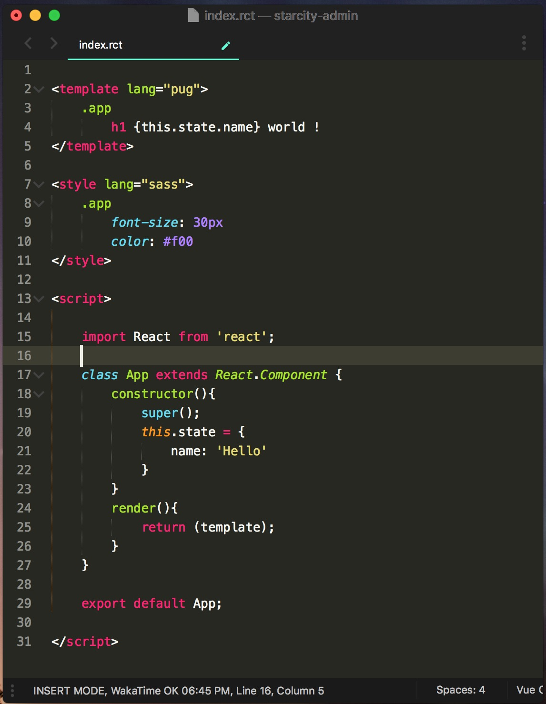

# rct-loader
> React.js component loader for [Webpack](https://webpack.js.org/)

<p align="center">
  
</p>

<h2 align="center">Usage</h2>


```bash
npm run rct-loader --save-dev
```

```javascript
module: {
  rules: [
    {
      test: /\.rct$/,
      exclude: /(node_modules|bower_components)/,
      use: {
        loader: 'rct-loader'
      }
    }
  ]
}
```

_This project is debugging now，the release version is coming soon !_